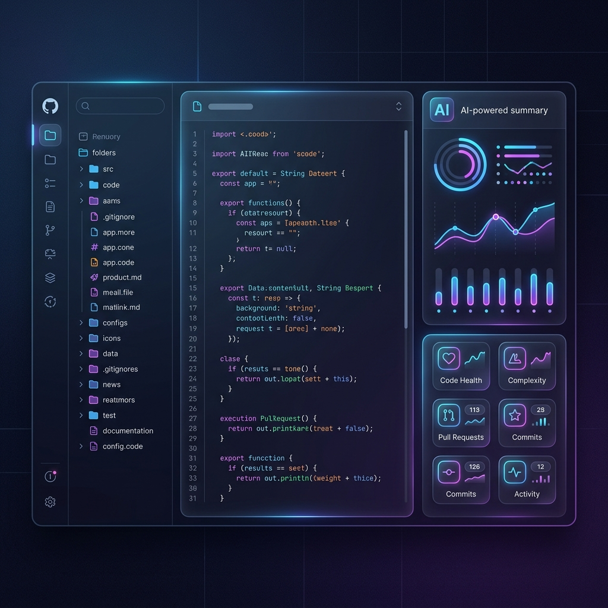

<p align="center">
  
</p>

<h1 align="center">🔍 RepoLens</h1>

<p align="center">
  <strong>Navigate Code at the Speed of Thought.</strong><br/>
  High-fidelity repository intelligence powered by a custom fine-tuned <strong>RepoLens-7B</strong> model.
</p>

<p align="center">
  
  
  
  
  
</p>

<p align="center">
  <a href="#-quick-start">Quick Start</a> •
  <a href="#-features">Features</a> •
  <a href="#-hybrid-ai-architecture">AI Architecture</a> •
  <a href="#-chrome-extension-setup">Extension</a> •
  <a href="#-architecture">Architecture</a>
</p>

---

## ✨ Features (High-Voltage Edition)

| Feature | Description |
|---------|-------------|
| 🌲 **Interactive File Tree** | Browse any public GitHub repo with a collapsible, syntax-aware sidebar |
| 🤖 **Hybrid AI Synthesis** | 4-way parallel analysis powered by a primary **Groq (LLaMA 3.3)** engine with a private **HuggingFace (RepoLens-7B)** fallback |
| 📊 **Visual Multi-Tab Dash** | Instant structured breakdowns: Summary, Purpose, Complexity, Key Exports, and suggested next reads |
| 📐 **Dependency Graph** | Visual mapping of imports/exports with automated architecture role classification |
| 📖 **Definitions Explorer** | Behavioral analysis of every function, class, and constant in the file |
| 🚀 **Onboarding Engine** | Custom guides for new contributors: prerequisites, key concepts, and modification workflows |
| 🧩 **Chrome Extension** | Zero-context-switching: injects the premium RepoLens sidebar directly into GitHub pages |
| 💎 **Premium UI** | Glassmorphic design system with ambient glow effects and high-fidelity transitions |

---

## 🚀 Quick Start

### Prerequisites

- **Node.js** ≥ 18
- **AI Engine Token**: RepoLens uses a hybrid model. You can provide your own Groq key or use the RepoLabs fine-tuned token.
- **GitHub PAT**: (Optional) For higher repo scanning rate limits.

### Installation

```bash
# Clone the repository
git clone https://github.com/ashwinasthana/RepoLens.git
cd RepoLens

# Install dependencies
npm install

# Run the Dev Server
npm run dev
```

Open [http://localhost:5173](http://localhost:5173). The app will guide you through setting up your **AI Engine Token** on first launch.

---

## 🤖 Hybrid AI Architecture

RepoLens ensures 100% uptime and high-quality responses through a hierarchical provider model:

1.  **Primary (Groq LLaMA 3.1 8B)**: Utilized for high-speed, structured JSON outputs.
2.  **Fallback (HuggingFace RepoLens-7B)**: A custom fine-tuned model optimized specifically for repository structure analysis, acting as an automated fallback if the primary engine is unavailable.

### Analysis Pipeline
Every file click triggers **four parallel analyses**:
- **Summary**: Concise purpose and complexity mapping.
- **Graph**: Data flow and architectural positioning.
- **Definitions**: Deep-dive into exported symbols and behavioral patterns.
- **Onboarding**: Step-by-step modification and pitfall guides for new developers.

---

## 🧩 Chrome Extension Setup

1. Open `chrome://extensions/` in Chrome.
2. Enable **Developer mode**.
3. Click **Load unpacked** and select the `extension/` folder in this repo.
4. Navigate to any GitHub repository — you'll see a **🔍 RepoLens** button injected into the page.

> **Note:** To set your token via the console for the extension:
> ```js
> chrome.storage.sync.set({ groqApiKey: 'your_token_here' })
> ```

---

## 🏗️ Architecture & Stack

- **UI**: React 18 + Vite 5
- **Styling**: Vanilla CSS Modules (Glassmorphism & High-Voltage aesthetic)
- **Engine**: Hybrid Groq/HuggingFace Pipeline
- **Icons**: Tabler Icons
- **Deployment**: GitHub Pages (Static Hosting)

---

## 🤝 Contributing

Contributions are welcome! If you find RepoLens useful, consider giving it a ⭐

---

## 📄 License

This project is open source and available under the [MIT License](LICENSE).

<p align="center">
  <strong>Built for the modern developer.</strong><br/>
  <sub>© 2026 RepoLens Hub</sub>
</p>

Contributions are welcome! Here's how to get started:

1. **Fork** the repository
2. **Create** a feature branch: `git checkout -b feat/my-feature`
3. **Commit** your changes: `git commit -m "feat: add my feature"`
4. **Push** to the branch: `git push origin feat/my-feature`
5. **Open** a Pull Request

### Project Conventions

- **CSS Modules** for component styles (`.module.css`)
- **Satoshi** font for headings, **Inter** for body text
- **GitHub dark theme** color palette (`--bg: #0d1117`, `--accent: #58a6ff`)
- **Tabler Icons** (React) for all iconography

---

## 📄 License

This project is open source and available under the [MIT License](LICENSE).

---

<p align="center">
  <strong>Built with ☕ and curiosity</strong><br/>
  <sub>If you find RepoLens useful, consider giving it a ⭐</sub>
</p>
